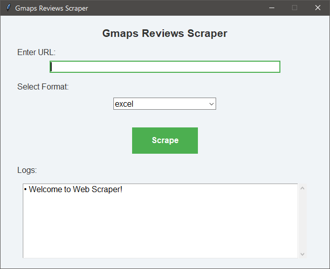
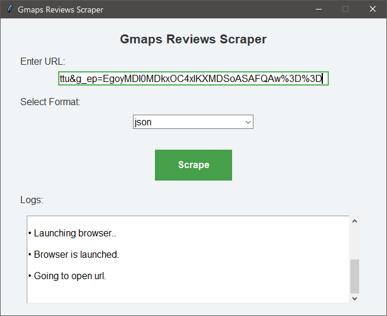
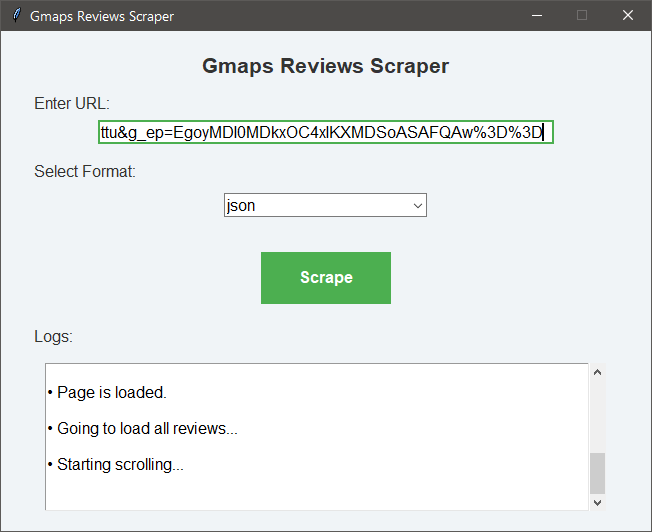
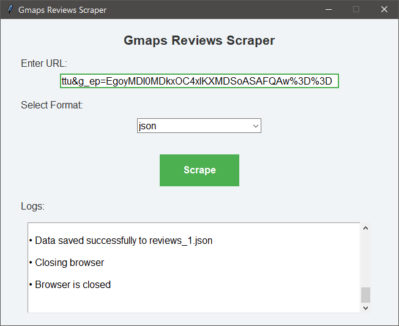
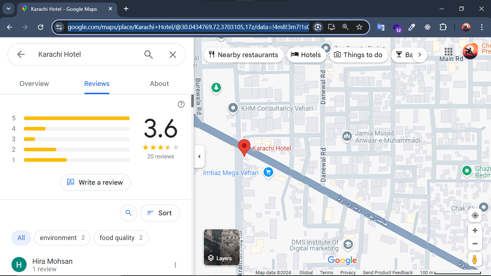

# Google Maps Reviews Scraper - A No-Code Python Tool

A user-friendly scraper developed to extract reviews from Google Maps Places without coding experience required.

**Perfect for beginners and those who want to scrape data without diving deep into Python or web scraping!**

---

## Need Help?

If you encounter any issues, just send an email to [contact@zubdata.com](mailto:contact@zubdata.com), and we will try to resolve your issue immediately.

---

## Features

- Simple installation and setup process
- User-friendly GUI, perfect for beginners and non-experts
- Fast performance
- Export data in Excel, JSON, and CSV formats

---

## Screenshots






---

## Data Points You Can Scrape

This scraper allows you to extract the following information:

- **Review Text**
- **Reviewer's Name**
- **Total Stars**
- **Date**

### Sample Output

```json
{
    "review_text": "Good quality food but very poor service and customer dealing. They only deliver the order if it’s too big; otherwise, they do not even listen to you. Food: 4, Service: 1, Atmosphere: 3",
    "total_stars": "1 star",
    "reviewer_name": "Hira Mohsan",
    "published_date": "a month ago"
}
```

Want to add more data points? Reach out to us at [contact@zubdata.com](mailto:contact@zubdata.com), and we’ll ship that feature for you asap!

---

## Getting Started

1. **Clone the Repository:**

   Open your terminal and run:

   ```bash
   git clone https://github.com/Zubdata/google-maps-reviews-scraper.git
   ```

   Then, navigate to the project directory:

   ```bash
   cd google-maps-reviews-scraper
   ```

2. **Set Up the Scraper:**

   - **For Windows Users:**

     Run this command:

     ```bash
     ./setup_win.ps1
     ```

   - **For Linux Users:**

     Execute the following command:

     ```bash
     ./setup_linux.sh
     ```


   This will install the necessary dependencies and Chromium browser, and then launch the GUI.

3. **Enter the Place URL:**

   Once GUI is opened, enter the URL of the location with the reviews section open. 

   **Example URL:**

   

4. **Choose Output Format:**

   Select the desired format for your data output. You can choose from three options:
   - Excel
   - JSON
   - CSV

5. **Click the `Scrape` Button:**

   Wait for the scraper to collect the data.

6. **Check the Results:**

   After the scraping process is complete, you can find the saved file in the root directory of the repository.

7. **Utilize the Data:**

   Leverage the extracted information to make a positive impact in the world!

--- 

## Request a Feature

We welcome your feedback! If you have any suggestions for features or improvements in the app, please feel free to email us at [contact@zubdata.com](mailto:contact@zubdata.com) with your requirements. We’ll do our best to implement your request as quickly as possible!

## Support Us

You can support us in a few simple ways:

- ⭐ Star the repository to show your support.
- Share it with anyone in your network who might benefit from it.
- If this tool has saved you time or money, consider buying me a coffee! Your support helps me create even more useful tools like this.

   [](https://www.buymeacoffee.com/zubdata)
